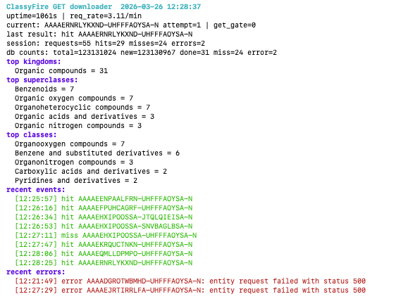

# ClassyFire GET Downloader

[](https://github.com/LucaCappelletti94/classyfire/actions/workflows/ci.yml)
[](https://doi.org/10.5281/zenodo.19235916)
[](LICENSE)

Rust downloader for importing PubChem `CID-InChI-Key` data into SQLite and crawling ClassyFire only through `GET /entities/{InChIKey}.json`.

We do not recommend running this tool yourself. We are already running it and publishing weekly Parquet snapshots to Zenodo. Once the public Zenodo record URL is in place, you should download the published dataset from there instead of placing additional load on the upstream ClassyFire service. The code is shared for transparency, reproducibility, and long-term stewardship of the recovered labels.

This project exists to build a local, durable copy of ClassyFire labels for PubChem compounds. The goal is to recover as many stable ClassyFire classifications as possible into a dataset that can later be exported, audited, used to train or validate a local replacement, and periodically published as archival Zenodo releases.

The code deliberately sticks to the `GET /entities/{InChIKey}.json` path because it has been much less fragile than the batch query flow. The batch endpoints were accepted by the server, but in practice they were too unreliable to drain at scale, with slow queues, throttling, HTML error pages, and multi-page result retrieval failures. This downloader therefore optimizes for boring long-run stability rather than maximum short-term throughput.

The underlying service should also be treated with caution. The original ClassyFire paper presents the system as a freely accessible large-scale API and discusses a path toward full open sourcing, but in practice the public service has been unreliable for bulk access and the historical software stack depended on proprietary ChemAxon components. This project therefore assumes that long-term durability must come from local copies, local exports, and periodic archival releases rather than trust in the upstream service remaining stable or fully reproducible.

This also means the full PubChem crawl is extremely slow. PubChem currently contributes about 123.1 million unique `InChIKey`s. At the observed live rate of roughly 3.1 GET requests per minute, a full pass would take on the order of 75 years. Even at the nominal 5-second cadence used by this downloader (12 requests per minute), a full pass would still take about 19.5 years. In other words, this is a long-running label recovery project, not a short-term scrape.

## What It Does

- imports the PubChem `CID-InChI-Key` dump into SQLite
- resumes interrupted imports from a saved checkpoint
- runs a single conservative GET loop over unresolved `InChIKey`s
- stores raw successful ClassyFire JSON as compressed blobs
- tracks `new`, `done`, `miss`, and `error` states
- keeps durable aggregate counters for a small live TUI
- exports recovered labels as JSONL and Parquet
- can publish weekly Parquet snapshots to Zenodo when configured

`run-get` always prefers untouched `new` rows. Once there are no `new` rows left, rerunning the same command on the same DB naturally revisits `error` rows and skips everything already classified or permanently missed.

## Main Commands

Import PubChem:

```bash
cargo run --release -- import-pubchem \
  --db /mnt/bfd/classyfire/classyfire.sqlite \
  --input /tmp/CID-InChI-Key.full.txt
```

Run the downloader:

```bash
cargo run --release -- run-get \
  --db /mnt/bfd/classyfire/classyfire.sqlite
```

Inspect counts:

```bash
cargo run --release -- stats \
  --db /mnt/bfd/classyfire/classyfire.sqlite
```

Export recovered labels:

```bash
cargo run --release -- export-labels \
  --db /mnt/bfd/classyfire/classyfire.sqlite \
  --output /mnt/bfd/classyfire/labels.jsonl
```

Export recovered labels as Parquet:

```bash
cargo run --release -- export-parquet \
  --db /mnt/bfd/classyfire/classyfire.sqlite \
  --output /mnt/bfd/classyfire/labels.parquet
```

Publish a Parquet snapshot to Zenodo immediately:

```bash
cargo run --release -- publish-zenodo \
  --db /mnt/bfd/classyfire/classyfire.sqlite
```

Rebuild aggregate counters from stored raw JSON:

```bash
cargo run --release -- rebuild-counters \
  --db /mnt/bfd/classyfire/classyfire.sqlite
```

## CLI View

The downloader ships with a small live terminal dashboard so you can see the current key, request rate, DB state counts, top taxonomy counts, and recent errors while the crawl is running.



## Defaults

Runtime defaults are in `src/config.rs`:

- database path default: `/mnt/bfd/classyfire/classyfire.sqlite`
- GET cadence: `5s`
- throttle backoff: `300s`
- request timeout: `30s`
- Zenodo publish interval: `604800s` (`7 days`)

All operational defaults can be overridden with `CLASSYFIRE_*` environment variables. The binary loads them from `.env` automatically at startup.

Start by copying the checked-in example:

```bash
cp .env.example .env
```

Weekly Zenodo publishing is disabled unless both of these are set:

- `ZENODO_TOKEN`
- `CLASSYFIRE_ZENODO_DEPOSIT_ID`

When they are present, `run-get` starts a background publisher thread that exports a Parquet snapshot and publishes a new Zenodo version every week.

## Stored Data

- `molecules`: one row per unique `InChIKey`, with state and raw successful JSON
- `cid_map`: PubChem `CID -> InChIKey`
- `state_counts`: cached totals for `new`, `done`, `miss`, `error`
- `taxonomy_counts`: cached counts for kingdom, superclass, class, subclass, and direct parent

## License

MIT
